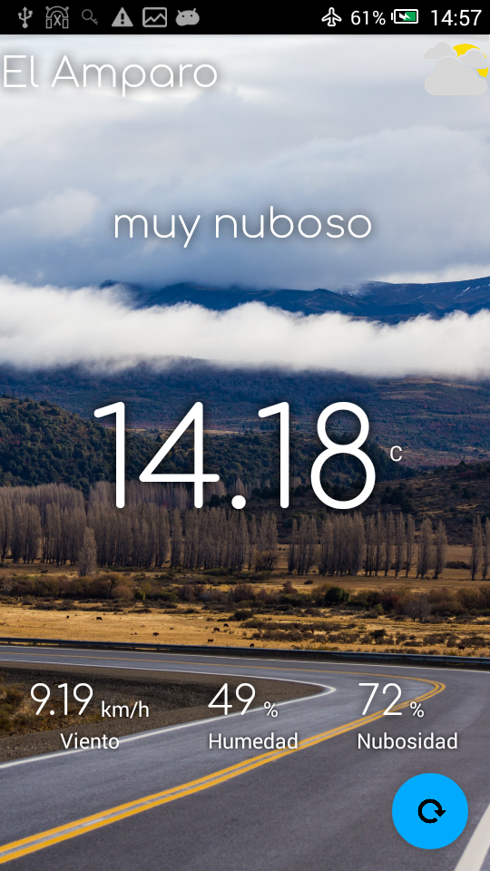
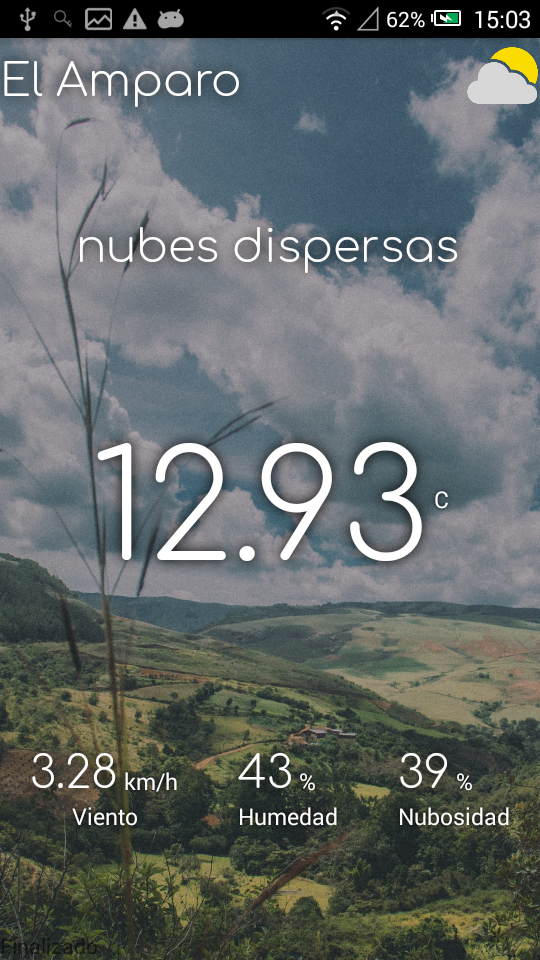

#  Fotoclima

Cambia el fondo de pantalla según el clima actual.

Obtiene información del clima de https://openweathermap.org/
Utiliza recursos (fotografías) de https://unsplash.com/

## Características:

* Muestra el clima actual.
* Muestra una fotografía en el fondo.
* Cambia el fondo de pantalla.
* Permite actualizar manualmente.
* Permite configurar la API.

## Capturas

## Donaciones

* Libre de Publicidad.
* Libre de Rastreadores.
* Libre de Telemetría.
* Libre de Código Propietario.
* Libre... de ingresos.

Al no tener publicidad este proyecto se mantiene únicamente con donaciones.
Siguiendo este enlace tendrás más información y también más aplicaciones.
[Más información](https://gitlab.com/javipc/mas) 

